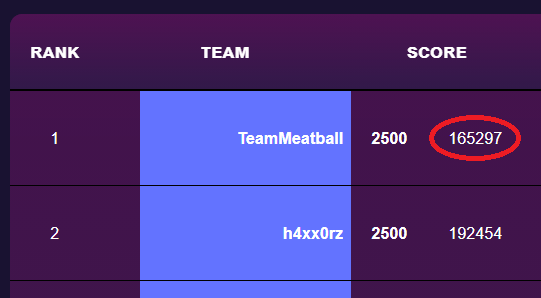
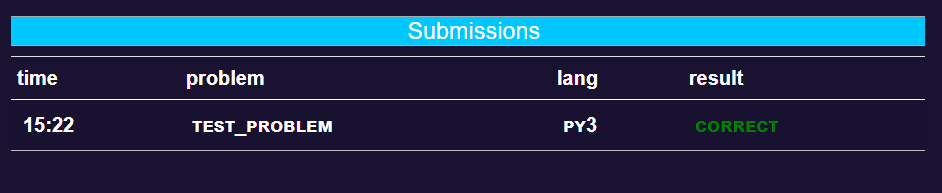

<p align="center" width="400">
  
</p>

# QHack 2021 Coding Challenge

The [QHack 2021 Coding Challenge](https://challenge.qhack.ai) presents a series of QML-based coding challenges for you to tackle. Please read the following carefully for details on the scoring system, how to register and submit your problems, and other aspects of the challenge.

### Template files are provided for you to simplify the submission process for the [QHack 2021 Coding Challenge](https://challenge.qhack.ai). Please base your solutions off of these template files as any other form of submission will likely fail the judging process. [Get the template files here](https://github.com/XanaduAI/QHack/tree/main/QML_Challenges/).

## Table of Contents
1. [Scoring System](#scoring)
1. [Solution Assessment](#assess)
1. [Problem Categories](#categories)
1. [Submission Templates](#templates)
1. [What's in the Templates](#provided)
1. [Setting Up Your Environment](#setup)
1. [Testing Your Solutions](#testing)
1. [How to Register](#register)
1. [Submitting Your Solutions](#submit)
1. [Submission Outcomes](#outcomes)
1. [Clarifications](#clarifications)
1. [Lost Password](#lostpwd)

## Scoring system<a name="scoring" />
### Points
Each challenge problem is worth a set number of points. The scoring system is pass/fail, meaning either your submission passes the judging criteria and you receive all the points for that problem, or your submission fails and you receive no points for that submission. If your submission fails you can modify and resubmit an unlimited number of times until your submission passes. 
### Time
In addition to your score in points, the cumulative time of submission since the start of the contest is also taken into account. For example, if you submit a correct solution for your first problem 15 minutes into the Challenge, your cumulative submission time would be 15 minutes. If you then submit your second correct solution 1 hour into the challenge, your cumulative submission time would then be 75 minutes. Incorrect or failed submissions do not count towards your cumulative submission time.

In the event of a tie between teams on points, the lowest cumulative submission time for successful submissions will break the tie. Your cumulative submission time in minutes is displayed next to your score on the Scoreboard:  
  


## Solution Assessment<a name="assess" />
The scoring system works on an input/output basis. A set of inputs are fed into your submitted Python script via `stdin` and the generated outputs are compared against the expected results. For all outputs except floating-point numbers, an exact match is required (unless otherwise specified in the problem file).  

When the answer to a challenge problem is one or more floating point values, a submission will pass so long as each value is within a certain tolerance of its accepted answer. This tolerance varies from problem to problem and is always relative, i.e., the absolute value of the difference between your solution and the accepted solution, divided by the accepted solution, should be smaller than the tolerance. The specific tolerance for a given problem will be clearly stated in a table at the end of its problem statement.   

The assessment system is strictly pass/fail, so a submission must be correct and satisfy each criterion outlined in the problem for all points to be awarded. The constraints of the system dictate that very little feedback will be provided in the event that your submission is deemed incorrect, so if this is the case double check your solution locally and compare with the sample data before resubmitting. There is no penalty for a wrong submission, save the cumulative submission time.

## Problem Categories<a name="categories" />

The Challenge problems are divided into 4 categories: 

- Simple Circuits
- Quantum Gradients
- Circuit Training
- Variational Quantum Eigensolver (VQE)

Each category contains 3 problems worth differing amounts of points. The "Simple Circuits" problem set contains questions valued at 20, 30, and 50 points. This category is intended primarily as a tutorial so you can get used to the submission process, as well as learn the basics of [PennyLane](https://pennylane.ai), the software library in which all the problems are written. The other three categories have problems valued at 100, 200, and 500 points. 

**The challenges may be completed in any order**, but for true beginners we recommend starting with the *Simple Circuits* problems before progressing to the more challenging ones. While in some cases solving the lower-valued problems will provide insight into the higher-valued ones, all of the problems are intended to be self-contained and do not require any code or numerical values to be carried forward through a category.

## Submission Templates<a name="templates" />

Because of the strict submission requirements, it is strongly encouraged that you base your submissions off of the supplied [problem templates](https://github.com/XanaduAI/QHack/tree/main/QML_Challenges/). 

Avoid modifying these templates in any way beyond where it is indicated for you to do so, as this will most likely result in a failed submission. Even within the modifiable portion of the script, do not add any print statements or try to plot, as this will interfere with the assessment of the solution.   

Do not import any external libraries in these templates. The only libraries that will be available when your submission is run are those in the [requirements.txt file](https://github.com/XanaduAI/QHack/blob/main/QML_Challenges/requirements.txt) found in the [problem templates repository](https://github.com/XanaduAI/QHack/tree/main/QML_Challenges/). 

### Downloading The Templates

If you use git:

```console
git clone https://github.com/XanaduAI/QHack.git
```  
or 
```console 
git clone git@github.com:XanaduAI/QHack.git
```  

If you don't use `git`, you can download a zipped version of this repository [here](https://github.com/XanaduAI/QHack/archive/main.zip).

### What's Provided For You<a name="provided" />

Every problem in the Coding Challenge has a corresponding directory nested under `QML_Challenges/` of the form `<problem_name>_<points>_template/`. Within each problem template folder are three types of files to help you with the coding challenges:  

1. **problem.pdf**  
    This is the statement of the problem you're being challenged to solve, along with any constraints that may be imposed. Read these over carefully before tackling the corresponding Coding Challenge problem. If you're having problems viewing these you can also find a description of the problems at [the Challenge Problems page](https://challenge.qhack.ai/public/problems).

2. **\<problem_name\>_\<points\>_template.py**  
    These are the Python coding templates required for submitting your solution to a particular problem. Read the docstrings within these files carefully to see what code is required from you and where exactly you should add your solution (typically between `# QHACK #` comment markers).   
    **NOTE:** It is extremely important that you do not import any additional libraries or modify any of the code in these files other than where specified, as this may result in your submission failing the automated judging process. See the sections below on testing your solutions locally and submitting them for judging.   
3. **\#.in and \#.ans files**  
    The numbered `.in` and `.ans` files are the input and corresponding expected output, respectively, for your solution. They are the data files for the problem. Do not modify these files! Once you have added your code to the `<>_template.py` file, passing the `#.in` file to the modified `<>_template.py` file via `stdin` should result in output that matches the corresponding `#.ans` file. Your generated answer may not match the value(s) in the corresponding `#.ans` file exactly, but that's normal. As long as they match to within a tolerance specified in the `problem.pdf` file, then your solution will be judged to be correct. More details on how to test your solutions locally are provided in a section below.

## Setting Up Your Environment<a name="setup" />

All solutions must be written in Python and be compatible with Python 3.7. Instructions for installing Python 3.7 are out of scope for this document, but many web resources exist for how to install Python 3.7 on your chosen OS.

We have included a [requirements.txt](https://github.com/XanaduAI/QHack/blob/main/QML_Challenges/requirements.txt) file that specifies the libraries which you will need to be able to run and test your solutions locally. Installing these can be done on the command line via `pip`:  

```console
pip install -r requirements.txt
```  

We recommend that you set up a virtual environment to keep these packages isolated from the rest of your installed Python libraries. Setting up a virtual environment is also out of scope for this document, but many tutorials for doing so with your Python distribution and OS are available online. 

## Testing Your Solutions<a name="testing" />

Once you have added your code to one of the solution templates, you can test if it is correct by supplying one of the `#.in` files for that problem to the solution script via stdin. 

For example, if you've added a solution for the 100 point Circuit Training problem and you want to test the solution using the first set of inputs, do the following:
 * Open a terminal console (`CMD`, `Terminal`, etc.) and navigate to the folder containing your solution
 * Run your modified Python template and pass in the inputs:  
`python ./circuit_training_100_template.py < 1.in`
 * Check what was output to the console. If everything worked, you should see a single number or series of comma delimited numbers and nothing else
 * Open the file `1.ans` for this problem and compare its contents to what was written to the command line. They should match to within some tolerance specified in the `problem.pdf` to be judged correct.

## How to Register<a name="register" />
You will need to register your Team in order to be able to submit your solutions and claim your points. There can only be one account associated with each Team, so if you're a Team of more than one person you should designate someone as Team Captain to register on behalf of the Team and submit the Team's solutions. 

To register, go to https://challenge.qhack.ai/register and enter the following:  

1. `Team name` - The name of your Team as it will appear on the Scoreboard.  
2. `Email address` - The email address associated with the account.  
3. `Username` - The login name for your account. You will use this login name to access your Team page.  
4. `Password` - The password for accessing your account.  
5. `Repeat Password` - Re-enter your password.    

  

Don't forget to read the [terms and conditions](https://qhack.ai/terms_and_conditions_2021.html) before registering. By registering, you agree to abide by the terms and conditions outlined therein.


## Submitting Your Solutions<a name="submit" />

Once you're satisfied that you have the correct solution and have tested it using the supplied data, you can submit it to the Coding Challenge to earn the points associated with that problem.

To submit your solution:  
1. Log into your Team's account at https://challenge.qhack.ai/login with the Username and Password used to register your Team.
2. Click the green "Submit" button in the top right corner:  


3. In the Submit pop-up window:    
  a. Click "Browse", which will open a file navigator. Navigate to the location of your Python script solution, select it, and click "Open".  
  b. Click the dropdown list under "Problem" to choose which problem you're submitting a solution for.   
  c. If the Language drop-down list doesn't auto-populate with "Python 3", click the dropdown list under "Language" and choose "Python 3". That should be the only option.  
  d. Click Submit! A popup will confirm your submission.  
  


Depending on the problem it can take anywhere from a few seconds to a few minutes to be assessed. In the meantime you should see a new entry under the Submissions section of the Team homepage (lower-left corner) with a `pending` result:  


Once the submission has been assessed, the result will be updated. You may need to refresh the page to see the new status:  



# Submission Outcomes<a name="outcomes" />
There are several possible outcomes following a submission:

### Correct
Congratulations! The points are yours.

### Wrong Answer
Some part of your solution is incorrect. Double check that when run locally your outputs match the expected outputs to within the allowed tolerance. 

### Run-Error
Something in your solution caused the assessment process to fail. Double check that you don't have any print statements, warnings, imports of additional packages, or other run-time errors.

### Too-Late
The contest has temporarily ended to award the prizes to the top Teams. Don't worry, once the contest is restarted this submission will be graded and appear on the scoreboard. 

## Clarifications<a name="clarifications" />
If you have a question about one of the problems that is not answered in the PDF description document for that problem, or suspect there is an error in one of the problems, or you would like to dispute an assessment, you can request a clarification by clicking the "request clarification" button on your Team's home screen:  

 

This will open a window where you can compose a message for the organizers:  

 
Under "Subject" you can choose a specific problem if this is a clarification for a particular problem, or specify that this is a general or technical question. 

To help us help you, please provide as much detail as possible. Please be aware that due to the large number of teams participating we will not be able to respond to clarification requests immediately. These messages are private and will only be seen by the organizers.

Once submitted, a record of your clarification request will appear under the Clarification Requests section, and responses will appear under the Clarifications section directly above that. Clicking on either entry will give you the full text and details of the message:  

   


## Lost Password<a name="lostpwd" />
Unfortunately there is no mechanism for you to change or reset your password yourself, so please have your web browser remember your Team's login details, or record them some other way. If you have lost the password for your Team's account and need it reset you will need to contact `admin@qhack.ai` using the same email address you registered with the judging system.
